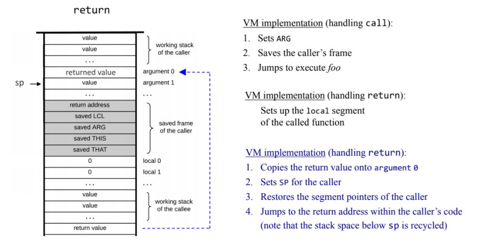

[Calling conventions and stack frames RISC-V](https://www.youtube.com/watch?v=s-Z5t_yTyTM)视频中讲了这样一段汇编。
```python
sum_to:
  mv t0, a0          # t0 <- a0
  li a0, 0           # a0 <- 0
loop:
  add a0, a0, t0     # a0 <- a0 + t0
  addi t0, t0, -1    # t0 <- t0 - 1
  bnez t0, loop      # if t0 != 0: pc <- loop
  ret

.global sum_then_double
sum_then_double:
  addi sp, sp, 16    # function prologue:
  sd ra, 0(sp)       # make space on stack, save registers
  call sum_to
  li t0, 2
  mul a0, a0, t0
  ld ra, 0(sp)       # function epilogue:
  addi sp, sp, -16   # restore registers, restore stack pointer
  ret
```
视频中老师提了个问题，如果把sum_then_double函数中保存和加载sp的那几行给去掉，会怎么样？  
```python
sum_then_double:
  call sum_to
  li t0, 2
  mul a0, a0, t0
  ret
```
想着前段时间做nand2tetris的时候自己还写过vm translator，将vm code翻译为汇编语言，中间如何实现函数的调用和返回正好可以解答这一问题。但是我现在竟然想不起来了，真是太菜了，感觉还是得记录一下。  

这是[nand2tetris vm课件](https://drive.google.com/file/d/1lBsaO5XKLkUgrGY6g6vLMsiZo6rWxlYJ/view?usp=sharing)中得一张截图。首先有两个概念，被调用的函数叫做callee，调用这个函数的函数叫做caller，以上述代码为例，sum_to就是一个callee，sum_then_double就是caller。caller在调用其他函数之前需要保存return address，return address是什么东西呢？只要知道return address是给程序计数器PC用的，就好理解了，return address指向callee执行完毕后接下来需要执行的指令。以上述代码为例，sum_then_double在调用sum_to之前（程序计数器跳转到sum_to的代码之前），会保存return address，return address应指向`call sum_to`的下一行，即`li t0, 2`。这样cpu执行完sum_to后，PC就会load return address，执行`li t0, 2`。现在再回头看开头的问题，如果去掉那几行，即不保存也不加载return address，sum_to执行完后，PC会指向sum_to函数的后一行`.global sum_then_double`，再接着又会执行sum_then_double，这样就会一直循环下去。  
写这篇文章的时候我还不会risc-v的汇编，但是逻辑上应该没啥问题。